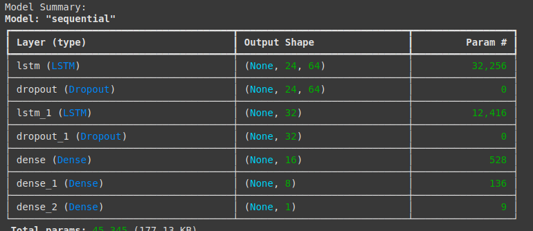
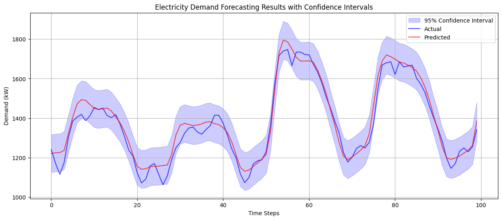
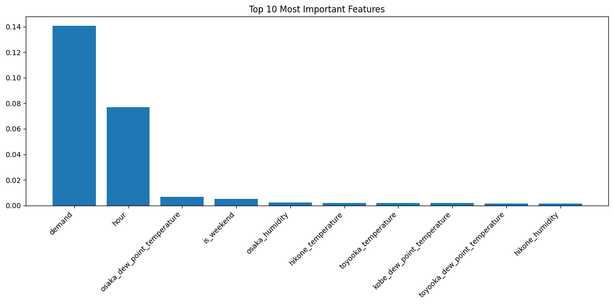
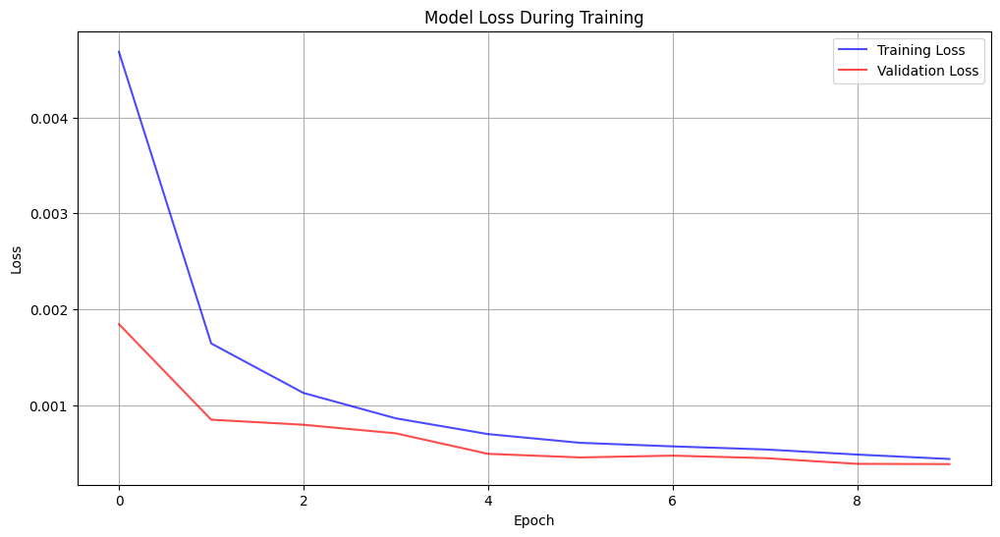

# Electricity Demand Forecasting

A deep learning model for forecasting electricity demand using weather data from multiple cities. The model combines LSTM neural networks with comprehensive weather features to predict future electricity consumption patterns.


*Sample prediction results showing actual vs predicted electricity demand with confidence intervals*

## Features

- Multi-city weather data integration
- LSTM-based deep learning architecture
- Automatic data preprocessing and cleaning
- Feature importance analysis
- Comprehensive error metrics and visualization
- Built-in data validation and error handling
- Model performance monitoring with early stopping

## Model Architecture


*LSTM model architecture with layer specifications*

The model uses a stacked LSTM architecture:
1. Input Layer
2. LSTM (64 units) with return sequences
3. Dropout (0.2)
4. LSTM (32 units)
5. Dropout (0.2)
6. Dense (16 units, ReLU)
7. Dense (8 units, ReLU)
8. Dense (1 unit, output)

## Prerequisites

```
pandas
numpy
scikit-learn
tensorflow
matplotlib
```

## Project Structure

```
├── data/
│   ├── Weather/           # Weather data CSV files for different cities
│   └── electricity_demand/
│       └── demand.csv     # Electricity demand historical data
├── images/               # Store your visualization images here
├── main.py              # Main script
└── best_model.h5        # Saved best model weights (generated during training)
```

## Sample Results

### Prediction vs. Actual

*Actual vs. predicted electricity demand with confidence intervals*

### Feature Importance Analysis

*Top features contributing to the prediction model*

### Training History

*Model loss during training showing convergence*

## Data Format

### Weather Data
Place your weather CSV files in the `data/Weather` directory. Each file should:
- Be named as `cityname.csv`
- Include columns for temperature, humidity, wind direction, etc.
- Have a 'datetime' column


### Demand Data
The `demand.csv` file should contain:
- A 'datetime' column
- An 'actual_performance' column with electricity demand values


## Key Functions

### `load_and_preprocess_weather_data()`
- Loads weather data from multiple city CSV files
- Converts wind directions to numeric values
- Handles missing values
- Combines data from all cities

### `prepare_data()`
- Creates time-based features (hour, day of week, month)
- Scales data using MinMaxScaler
- Creates sequences for LSTM training
- Performs comprehensive data validation

### `create_model()`
- Implements a sequential LSTM architecture
- Uses dropout layers for regularization
- Includes multiple dense layers for fine-grained predictions

### `train_model()`
- Implements early stopping
- Features learning rate reduction on plateau
- Saves best model weights
- Provides training history

### `analyze_feature_importance()`
- Calculates feature importance using permutation importance
- Visualizes top contributing features
- Helps in understanding model decisions


## Usage

1. Prepare your data:
   ```
   data/
   ├── Weather/
   │   ├── city1.csv
   │   ├── city2.csv
   │   └── ...
   └── electricity_demand/
       └── demand.csv
   ```

2. Run the main script:
   ```bash
   python main.py
   ```

3. The script will:
   - Load and preprocess data
   - Train the model
   - Generate performance visualizations
   - Save the best model
   - Analyze feature importance

## Output

The model provides:
- Detailed metrics (MSE, MAE, RMSE, MAPE)
- Prediction vs. actual plots with confidence intervals
- Training history visualization
- Feature importance analysis
- Model performance statistics

## Error Handling

The code includes comprehensive error handling for:
- Missing data
- Invalid data formats
- Infinite values
- NaN values
- Data type mismatches

